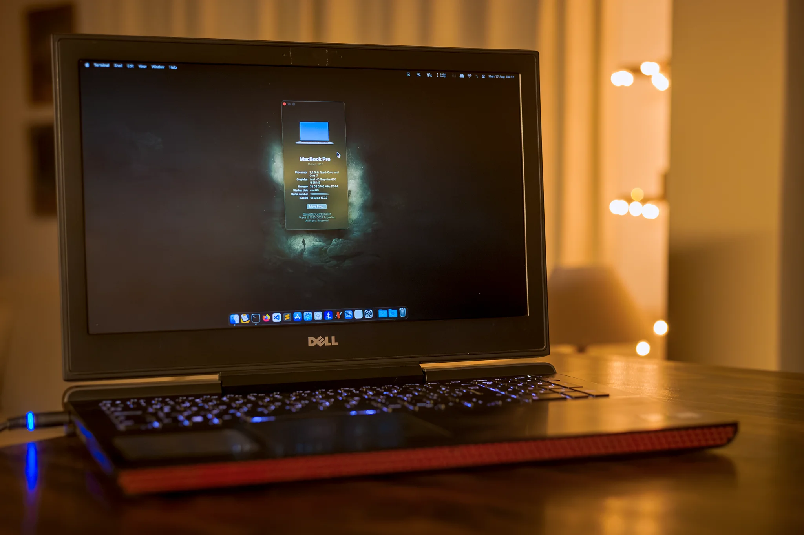
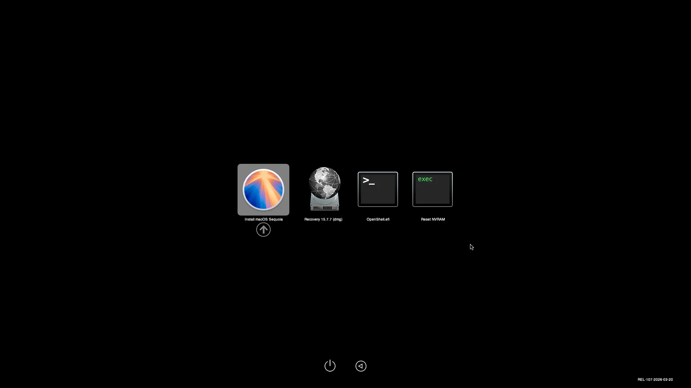
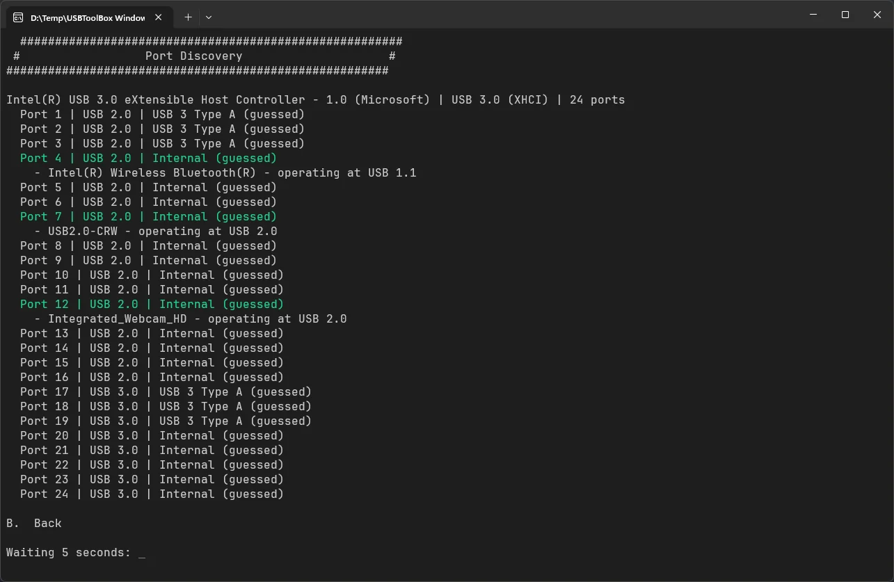
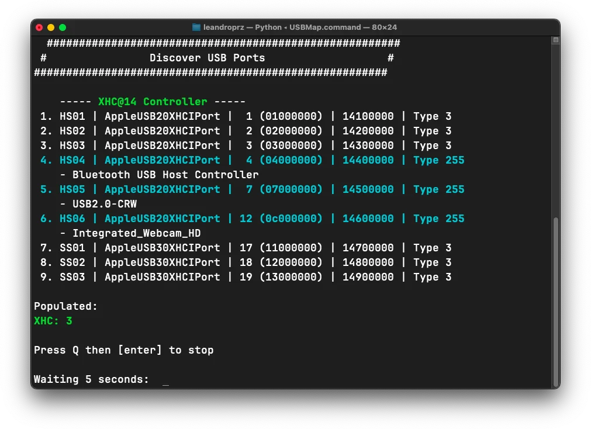
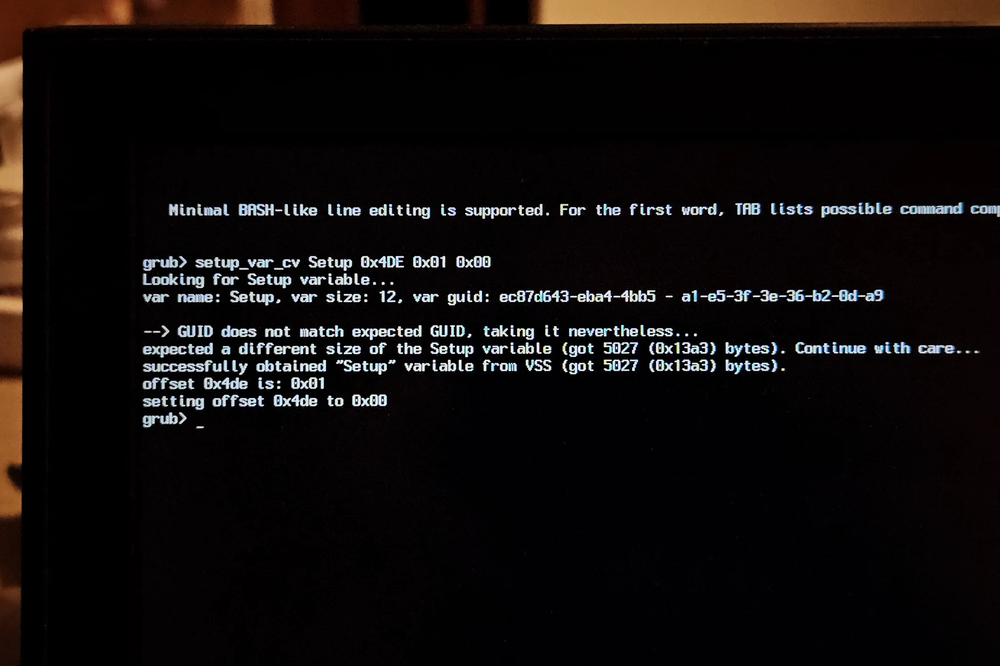
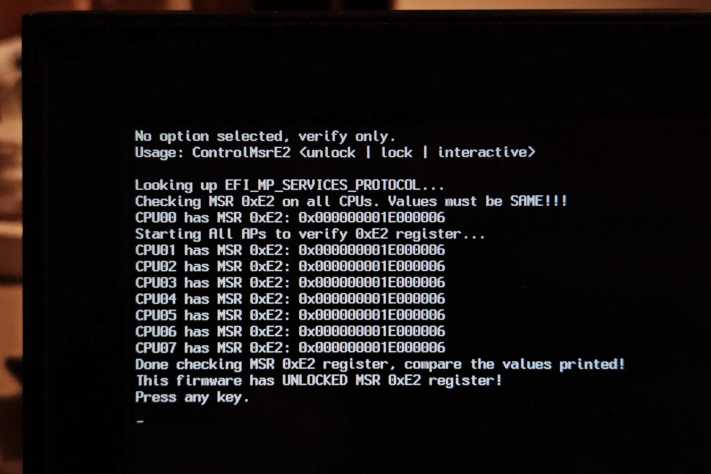

# Dell 7567 laptop Hackintosh - OpenCore 1.0.7

<a href="assets/dell-7567-macos-desktop.webp" title="Dell 7567 laptop running macOS">
    
</a>


  

This is my manually built EFI following [Dortania's OpenCore Install Guide](https://dortania.github.io/OpenCore-Install-Guide/) that uses the [OpenCore bootloader](https://github.com/acidanthera/OpenCorePkg).

This guide will teach you how to use the EFI on this repository for a **Dell 7567 laptop** with the hardware [listed below](#hardware-specifications) so you can install macOS on your own computer.

Keep in mind that this is meant to be used as a starting point to get you quickly up and ~~running~~ booting into macOS. For everything else I'll link you to the right guide so you can follow what others have already written and is far better covered and explained than anything I could say here.

# TL;DR

1. Clone this repository using `git clone https://github.com/leandroprz/Dell-7567-Laptop-Hackintosh-OpenCore.git` or download the EFI from [Releases](https://github.com/leandroprz/Dell-7567-Laptop-Hackintosh-OpenCore/releases)
2. Generate and fill the missing info in the `config.plist` with your own SMBIOS using [GenSMBIOS](https://github.com/corpnewt/GenSMBIOS)
3. Use [Mist](https://github.com/ninxsoft/Mist) on an Intel Mac to get the `.app` installer or follow the [Dortania Creating the USB guide](https://dortania.github.io/OpenCore-Install-Guide/installer-guide/) to get a proper macOS installer
4. Mount the EFI partition of your USB and copy over the EFI folder you got from this repo
5. Update and modify the BIOS on your Dell 7567 laptop by following the instructions [listed below](#bios-settings)
6. Boot OpenCore from the USB you prepared and select _Install macOS Sequoia_ from the picker
7. If everything went OK, you should arrive at the installer screen. Choose _Disk Utility_, click the _View_ icon on the top left and choose _Show All Devices_, then click on _Erase_ and format the drive itself using `APFS` and `GUID Partition Map`
8. Close _Disk Utility_ and start the _macOS Installer_. Follow the steps on screen to install macOS. The computer will reboot about 3 times and without any intervention you should get the _First Time Setup_ screen once the installer finishes
9. Use [MountEFI](https://github.com/corpnewt/MountEFI) to mount both your USB and SSD EFI partitions. Copy the EFI folder from your bootable USB to your SSD. After this you no longer need your USB drive to boot into macOS
10. Follow the [OpenCore Post-Install](https://dortania.github.io/OpenCore-Post-Install/) guide to get your hackintosh as optimized as possible

If you want to learn more or need to do some troubleshooting, keep reading.

# Overview

Here I'll share some information I gathered along the way while building my EFI for this 2017 laptop as well as some recommendations to get everything working as stable as possible.

Right now I'm triple booting _Windows 11_, _macOS Sequoia_ and _CachyOS_ on a **single NVMe drive** and everything works perfectly fine. If you only want to install macOS, just keep reading. If you want to double or triple boot, first take a look at the [Triple boot setup guide](https://github.com/leandroprz/Dell-7567-Laptop-Hackintosh-OpenCore/triple-boot.md), since it is important to first partition your drive the right way to avoid issues down the road.

Based on this laptop's hardware I decided it was best to use `MacBookPro14,3` for the SMBIOS, since the laptop:

- Has a Kaby Lake i7-7700HQ CPU
- Has a 15.6" screen
- Has a dGPU

The SMBIOS [can have a real impact](https://dortania.github.io/OpenCore-Install-Guide/extras/smbios-support.html) on your hackintosh performance, so it is recommended to choose what's closer to your hardware to avoid issues.

But there's just a small problem, `MacBookPro14,3` is [only supported up to macOS Ventura 13.6.x](https://support.apple.com/en-us/108052), so we're going to bypass that with a [patch](https://github.com/dortania/OpenCore-Legacy-Patcher/blob/main/payloads/Config/config.plist#L220-L243) and a [kext](https://github.com/acidanthera/RestrictEvents) so we can install macOS Sequoia 15.7.x. Kaby Lake is still fully supported by Apple on newer devices.

# Table of contents

FILL ME********

# Hardware specifications

| Component      | Details                                                                           |
| -------------- | --------------------------------------------------------------------------------- |
| Laptop         | Dell 7567 - HM175 chipset (Dell Inspiron 15 7000 Gaming series)                   |
| CPU            | Intel i7-7700HQ                                                                   |
| RAM            | 32GB DDR4 2400MHz Kingston (2x16GB)                                               |
| Integrated GPU | Intel HD Graphics 630                                                             |
| Discrete GPU   | NVIDIA GeForce GTX 1050 Ti                                                        |
| Storage        | NVMe WD_BLACK SN7100 2TB + SATA SanDisk SD Ultra 3D 1TB                           |
| Wireless       | Intel Dual Band Wireless-AC 3165 + Intel Wireless Bluetooth (`VID_8087&PID_0A2A`) |
| Ethernet       | Realtek PCIe GBE RLT8168/8111                                                     |
| Audio          | Realtek ALC256 High Definition Audio                                              |
| Keyboard       | PS/2 keyboard (reported as `DLLK0798`)                                            |
| Mouse          | PS/2 mouse (reported as `DLL0767`)                                                |
| Touchpad       | HID-compliant touchpad (reported as `DLL0798, VID_06CB`)                          |
| Video port     | HDMI-out                                                                          |
| USB ports      | 3x USB Type-A 3.0                                                                 |
| Card reader    | Realtek SDHC Card Reader (`VID_­0BDA&­PID_­0177`)                                 |
| Webcam         | Dell Integrated WebCam (`VID_1BCF&PID_28C1`)                                      |

# Compatibility status

## Working

- CPU power management
- Integrated GPU hardware acceleration
- All USB ports at their max speed
- Gigabit ethernet
- WiFi (using [HeliPort](https://github.com/OpenIntelWireless/HeliPort/))
- Onboard audio and integrated speaker 2.0 (no subwoofer)
- Touchpad/trackpad with gestures (this one took a LOT of work and research)
- Keyboard
- Brightness keys
- Fn keys
- Mouse
- Integrated webcam
- SDHC card reader
- Dell sensors
- Sleep and wake (one caveat, the keyboard backlight stays on during sleep)
- SIP enabled
- DRM support
- App Store
- iServices

## Partially working

- Bluetooth - Some devices are discoverable, but you can't connect to them. [This is a known _IntelBluetoothFirmware_ issue](https://openintelwireless.github.io/IntelBluetoothFirmware/FAQ.html#i-can-t-connect-to-device-xxx-but-it-s-successfully-discovered)

## Not working

- NVIDIA GeForce GTX 1050 Ti (not supported, disabled using an SSDT)
- HDMI - Since the port is directly connected to the dGPU, it doesn't work at all
- Location and Continuity services ([not compatible](https://openintelwireless.github.io/itlwm/FAQ.html#usage) with 
  `itlwm.kext`)
- OTA updates - Instead of downloading a small sized update for a minor version, you'll have to download the full installer

## Needs further testing

- 3.5mm jack - The headset earbuds work, but the mic does not. I have to test with a different `layout-id`

## Not tested

- Battery readings (my laptop does not have a physical battery)
- FileVault

## Performance

Here are three Geekbench 7 benchmarks:
- [CPU](https://browser.geekbench.com/v7/cpu/70376)
  - Single-core score: 1096
  - Multi-core score: 4069
- [GPU (OpenCL)](https://browser.geekbench.com/v7/gpu/37177)
  - Compute score: 3762
- [GPU (Metal)](https://browser.geekbench.com/v7/gpu/37164)
  - Compute score: 3643

# Getting started

## Generate a serial number

You MUST add your own _System Serial Number_, _System UUID_, _MLB_ and _ROM_ in the `PlatformInfo` section of the `config.plist` file, otherwise your system will not boot.

1. Download the latest EFI package from [Releases](https://github.com/leandroprz/Dell-7567-Laptop-Hackintosh-OpenCore/releases) or clone this repository: `git clone https://github.com/leandroprz/Dell-7567-Laptop-Hackintosh-OpenCore.git`
2. Run [GenSMBIOS](https://github.com/corpnewt/GenSMBIOS) and drop the `config.plist` in there to generate the _System Serial Number_, _System UUID_ and _MLB_ using `MacBookPro14,3` for the _SMBIOS_
3. For the _ROM_ you should use your Ethernet/WiFi MAC address (e.g.: `A4:80:F6:J8:I2:5K`). You can get this value by running `ipconfig /all` on Windows or `ifconfig` on macOS/Linux. Copy the MAC, open [ProperTree](https://github.com/corpnewt/ProperTree) and paste the value in _PlatformInfo > Generic > ROM_ with no colon `:` (e.g.: `a480f6j8i25k`)
4. Go to [Apple's Check Coverage Page](https://checkcoverage.apple.com/) and make sure your _System Serial Number_ shows up as **invalid serial**. You should get a message such as _The serial number you've entered isn't valid_. For more detailed instructions, refer to [Dortania's OpenCore Guide](https://dortania.github.io/OpenCore-Post-Install/universal/iservices.html#serial-number-validity)

## NVRAM values in `config.plist`

- `boot-args`: Keep `-v keepsyms=1 debug=0x100` for verbose mode in case you need to troubleshoot boot issues. Once your hackintosh works fine after setting everything up, you can remove all the arguments to just see the Apple logo instead of a cascade of white text
- `prev-lang:kbd`: I'm using `es_419-ES:89` because I have a Latin American keyboard, but you should definitely change this value to match your keyboard (e.g.: `en-US:0`). Check the available values in [this page](https://github.com/acidanthera/OpenCorePkg/blob/master/Utilities/AppleKeyboardLayouts/AppleKeyboardLayouts.txt)

## BIOS settings

1. [Download](https://www.dell.com/support/product-details/en-us/product/inspiron-15-7567-laptop/drivers?driverid=CRHGK&driveros=biosa&ld=CRHGK) and update the BIOS to the latest version
2. Reboot the laptop while pressing `F2` to get into the BIOS menu and reset to default settings
3. Reboot again, go to the BIOS menu one more time and change the following settings to be able to boot into macOS. Key Settings:
    - _General > Advanced Boot Options > Enable Legacy Option ROMs_ - Disable this option
    - _System Configuration > SATA Operation_ - Select _AHCI_
    - _Security > Secure Boot > Secure Boot Enable_ - Select _Disabled_
    - _Intel Software Guard Extensions > Intel SGX Enable_ - Disable this option
    - _POST Behavior > Fastboot_ - Select _Thorought_
    - _Virtualization Support > Virtualization > Enable Intel Virtualization Technology_ - Enable this option

The other settings can be left as is or change them to whatever you want.

# Creating a bootable USB

You'll need at least a 32GB USB stick for the installer. Do not use an Apple Silicon Mac (M1/M2/M3, etc) to download the installer. They download ARM64 installers, not the x86_64/AMD64 that we need for this Intel based laptop.

## Method 1: Using the official OpenCore guide

Follow the [Creating the USB OpenCore Install Guide](https://dortania.github.io/OpenCore-Install-Guide/installer-guide/).

## Method 2: Using an existing Intel Mac

1. Download and run [Mist](https://github.com/ninxsoft/Mist) to get a full offline installer
2. Open _Disk Utility_, click on the _View_ button on the top left and select _Show All Devices_
3. Select your USB stick, click on _Erase_ and format it:
    - Name: USB
    - Format: Mac OS Extended (Journaled)
    - Scheme: GUID Partition Map
4. Open the Terminal and run the following command:
```
sudo /Applications/Install\ macOS\ Sequoia.app/Contents/Resources/createinstallmedia --volume /Volumes/USB
```
5. Mount the USB's EFI partition using [MountEFI](https://github.com/corpnewt/MountEFI) and copy the modified OpenCore EFI folder into it. Your bootable macOS installer is now ready.

## Method 3: Using virtualized macOS on VMware

1. Set up [OC4VM](https://github.com/DrDonk/OC4VM) for [VMware Workstation Pro](https://support.broadcom.com/group/ecx/productdownloads?subfamily=VMware%20Workstation%20Pro&freeDownloads=true) (you'll need to create a free account on Broadcom's website to get the installer)
2. Once you have a working macOS virtual machine, you can follow all the steps in _Method 2_

## Tools you'll need immediately post-install

Make sure to download the following tools and copy them into the USB installer or use a second USB stick:

- [HeliPort](https://github.com/OpenIntelWireless/HeliPort)
- [MountEFI](https://github.com/corpnewt/MountEFI)

You should do this before installing macOS because you will not have access to a WiFi network to download them until you install _HeliPort_. You should have Internet via ethernet though, so you could just connect your laptop to your router using a cable until you have WiFi working on the computer.

# First boot

Boot from the USB stick by pressing `F12` during startup. You should see the OpenCore boot picker with different options:

<a href="assets/opencore-boot-picker.webp" title="OpenCore boot picker">
    
</a>


If you don't see all the options, press the `space bar` on your keyboard to make them visible.

Here's a quick rundown of what they do:

- _Install macOS Sequoia_: Boots into your macOS installer
- _Recovery 15.7.x (dmg)_: Boots into the recovery partition, useful for repairs
- _OpenShell.efi_: This is mainly for troubleshooting. Refer to [Troubleshooting](#troubleshooting) below for more information
- _Reset NVRAM_: Clears stored NVRAM variables. Useful if you notice that changes on your `config.plist` aren't applying correctly. If you clear the NVRAM you might need to manually re-add the boot entry in the BIOS menu

## macOS installation

At the OpenCore boot picker:

1. Select _Install macOS Sequoia_
2. Once at the installer screen, open _Disk Utility_. On the top left click on _View_ and then on _Show All Devices_
3. Select your internal SSD drive and click on _Erase_. Format it:
    - Name: macOS
    - Format: APFS
    - Scheme: GUID Partition Map
4. Close _Disk Utility_ and follow the macOS installation process selecting the drive you just formated. Your system will restart about 3 times. On each reboot the proper option to continue with the installation should be automatically selected for you until the installation process completes and you see the desktop

# Post-Installation

## Booting without the USB stick

1. Once at the desktop run [MountEFI](https://github.com/corpnewt/MountEFI) and mount both the USB and internal SSD EFI partitions
2. Copy the EFI folder from the USB to the internal SSD EFI partition. Your EFI folder should look like this:

```
EFI System Partition/
└── EFI/
    ├── BOOT/
    │   └── BOOTx64.efi
    └── OC/
        └── ACPI/
        └── Drivers/
        └── Kexts/
        └── Resources/
        └── Tools/
        └── config.plist
        └── OpenCore.efi
```

Done. You can now boot without the USB installer.

## Getting WiFi working

You will see no available WiFi networks on the top bar or in _System Settings > Wi-Fi_. Since we are using `itlwm.kext` to get WiFi working, you need to install an app called [HeliPort](https://github.com/OpenIntelWireless/HeliPort) to see and connect to the available networks around you.

## USB mapping

For this particular laptop it is necessary to USB map it in order to get the **integrated webcam**, **card reader** and **bluetooth** working, since those are internal USB devices. Make sure to map the other USB ports while you are at it.

The EFI in this repository is already mapped and contains the kexts for this (`USBToolBox.kext` and `UTBMap.kext`), but if your laptop has different port numbers than mine, yours will not work. In that case, do this on your own laptop, replace the kexts in `/EFI/OC/Kexts` and update the `config.plist` using [ProperTree](https://github.com/corpnewt/ProperTree).

### Mapping on Windows

The best way to do this is to run [USBToolBox](https://github.com/USBToolBox/tool) on Windows. You can follow the instructions [mentioned here](https://github.com/USBToolBox/tool#usage).

When mapping you should see the following for the three internal devices I mentioned above:

<a href="assets/usbtoolbox-win.webp" title="USBToolBox on Windows">
    
</a>


In my case they show as:

- Port 4: Bluetooth
- Port 7: SD card connected to the card reader
- Port 12: Integrated webcam

Yours might be a different number. Just make sure the type for those ports is set to `Internal: 255`. All the other ports should be mapped as both types USB 2 and USB 3.

### Mapping on macOS

If you can only do it from macOS, then I recommend you to remove the entries for `USBToolBox.kext` and `UTBMap.kext` from the `config.plist` and from `/EFI/OC/Kexts` and start from scratch using [USBMap](https://github.com/corpnewt/USBMap). You can follow the instructions [mentioned here](https://github.com/corpnewt/USBMap#before-you-begin).

When mapping you should see the following for the three internal devices I mentioned above:

<a href="assets/usbmap-mac.webp" title="USBMap on macOS">
    
</a>

In my case they show as:

- Port 4: Bluetooth
- Port 7: SD card connected to the card reader
- Port 12: Integrated webcam

Yours might be a different number. Just make sure the type for those ports is set to `Internal: 255`. All the other ports should be mapped as both types USB 2 and USB 3.

## Fixing CFG Lock

macOS needs a BIOS setting called _CFG Lock_ to be disabled to run stable. Since this is a macOS only thing, most vendors don't even show the setting in the BIOS menu, so to fix this you have to extract an offset from the BIOS firmware and patch it. This is perfectly explained in [Dortania's Fixing CFG Lock](https://dortania.github.io/OpenCore-Post-Install/misc/msr-lock.html).

For this step I'll share what I've found on my hardware + BIOS firmware, but it is strongly recommended to check if your setup is using the same offset, because offsets are unique not just to each motherboard but even to its firmware version.

After checking that my firmware was indeed locked using _ControlMsrE2.efi_, I extracted the offset and this is what I got:
```
CFG Lock, VarStoreInfo (VarOffset/VarName): 0x4DE, VarStore: 0x1
```
And:
```
VarStore: VarStoreId: 0x1 [EC87D643-EBA4-4BB5-A1E5-3F3E36B20DA9], Size: 0x13A3, Name: Setup {24 1C 43 D6 87 EC A4 EB B5 4B A1 E5 3F 3E 36 B2 0D A9 01 00 A3 13 53 65 74 75 70 00}
```
Finally, this was the command I used to unlock it using _Modified GRUB Shell_:
```
setup_var_cv Setup 0x4DE 0x01 0x00
```
Here's the output:

<a href="assets/cfg-unlock-1.webp" title="CFG unlocked using Modified GRUB Shell">
    
</a> <a href="assets/cfg-unlock-2.webp" title="CFG unlock check using ControlMsrE2">
    
</a>


If you are able to unlock it, remember to **disable** the following in your `config.plist`:

- _Kernel -> Quirks -> AppleCpuPmCfgLock_ - Set it to False
- _Kernel -> Quirks -> AppleXcpmCfgLock_ - Set it to False

# FAQ

## Why are there some kexts/plugins disabled?

**It's easier to maintain**. _VoodooPS2Controller_ comes with several bundled plugins, but not all of them are needed on this hardware. So instead of deleting them I decided to disable the following:

- `VoodooPS2Controller.kext/Contents/PlugIns/VoodooPS2Trackpad.kext`
- `VoodooPS2Controller.kext/Contents/PlugIns/VoodooInput.kext`

When updating _VoodooPS2Controller_ or _OpenCore_ it is always recommended to to an _OC Snapshot_ using [ProperTree](https://github.com/corpnewt/ProperTree). That program will always add the plugins back into the `config.plist`. So instead of dealing with that and deleting the plugins on every update, I just disabled them.

# Troubleshooting

## OpenCore UEFI Shell

Let's say you edited your `config.plist`, added a kext or mistyped something and suddenly your hackintosh doesn't boot. This is where this CLI tool comes in handy, since you'll be able to edit or restore your `config.plist`, then boot like nothing happened.

The _OpenCore UEFI Shell_ can be accessed via the OpenCore boot picker. Press the `space bar` if you don't see it. Then you'll see a screen with a _Mapping table_ that shows partitions named `FS0`, `FS1`, `FS2`, etc.

Say you need to edit the `config.plist` file while in the shell, type the following commands:
```
UEFI Interactive Shell v2.2
EDK II
UEFI v2.40 (American Megatrends, 0x0005000B)
Mapping table
    FS0:
    .
    .
    .
Press ESC in 1 seconds to skip startup.nsh or any other key to continue.

# Make the root of the partition the active directory
Shell> fs0:

# Check what partition you are on
FS0:\> vol
Volume EFI (rw)
206472192 bytes total disk space
122968576 bytes available on disk
512 bytes in each allocation unit

# List the files
FS0:\> ls
Directory of: FS0:\
08/01/2026  03:31 <DIR>     512  EFI
        0 File(s)           0 bytes
        1 Dir(s)

# Change directory
FS0:\> cd EFI/OC
FS0:\EFI\OC>

# Backup your config.plist
FS0:\EFI\OC> cp config.plist config.plist.bak
Copying FS0:\EFI\OC\config.plist -> FS0:\EFI\OC\config.plist.bak
- [ok]

# Edit the config.plist
FS0:\EFI\OC> edit config.plist

# You'll see the config.plist as pure text. Edit what you need
# Save the changes by pressing Ctrl+S and then Enter
# Exit the editor with Ctrl+Q

# Reboot to test your changes
FS0:\EFI\OC> reset
```
For more information on how to use this shell with other commands, you can check the following links:

- [OpenCore UEFI Shell for Hackintosh troubleshooting](https://chriswayg.gitbook.io/opencore-visual-beginners-guide/advanced-topics/opencore-uefi-shell)
- [Useful UEFI Shell Commands and Practical Examples](https://mundobytes.com/en/Useful-commands-for-the-UEFI-shell/)

## Where to ask for help

For other issues I recommend you to check the following:

- [Dortania's OpenCore General Troubleshooting](https://dortania.github.io/OpenCore-Install-Guide/troubleshooting/troubleshooting.html)
- [r/hackintosh](https://www.reddit.com/r/hackintosh/)
- [Reddit's r/hackintosh Discord channel](https://discord.gg/u8V7N5C)
- [InsanelyMac forum](https://www.insanelymac.com/forum/)

# Recommended apps

## Necessary apps for your hackintosh

- [HeliPort](https://github.com/OpenIntelWireless/HeliPort) - Since you are using `itlwm.kext`, you need this app to make your WiFi work

## Apps to improve usability

- [MOS](https://mos.caldis.me/) - Improve mouse scrolling
- [Raycast](https://www.raycast.com/) - Because Spotlight sucks
- [Stats](https://github.com/exelban/stats) - macOS system monitor in your menu bar. Useful to check if CPU power management is working properly
- [Tanoe](https://github.com/DrDonk/Tanoe) - Block macOS Tahoe updates

## Apps for troubleshooting your hackintosh

- [IORegistryExplorer](https://github.com/utopia-team/IORegistryExplorer) - Lets you gather info about I/O on macOS
- [Hackintool](https://github.com/benbaker76/Hackintool) - The Swiss army knife of vanilla Hackintoshing
- [MaciASL](https://github.com/acidanthera/MaciASL) - ACPI editing IDE for macOS

# References and credits

- [Dortania's OpenCore Install Guide](https://dortania.github.io/OpenCore-Install-Guide/)
- [OC-Little Translated](https://github.com/5T33Z0/OC-Little-Translated/)
  - [Kext Loading Sequence Examples](https://github.com/5T33Z0/OC-Little-Translated/tree/main/Content/10_Kexts_Loading_Sequence_Examples)
  - [Enabling Touchpad Support on Laptops](https://github.com/5T33Z0/OC-Little-Translated/tree/main/Content/05_Laptop-specific_Patches/Trackpad_Patches)
  - [Using unsupported Board-IDs with macOS 11.3 to 26](https://github.com/5T33Z0/OC-Little-Translated/tree/main/Content/09_Board-ID_VMM-Spoof)
  - [OCLP-4-Hackintosh](https://github.com/5T33Z0/OCLP4Hackintosh)
- [On fixing the trackpad (solution included)](https://github.com/Lukitronix/How-to-make-a-Hackintosh/issues/1)
- [Enable I2C Trackpad (VoodooI2C) - Not a Guide... not really](https://olarila.com/topic/5644-enable-i2c-trackpad-voodooi2c-not-a-guide-not-really/)
- [How to Fix Static Noise and Audio Distortion in Headphones on Laptops](https://elitemacx86.com/threads/how-to-fix-static-noise-and-audio-distortion-in-headphones-on-laptops-clover-opencore.2200/)
- [Left and Right Stereo Sound Test](https://www.youtube.com/watch?v=6TWJaFD6R2s)
- [USB mapping best practice?](https://www.reddit.com/r/hackintosh/comments/1b68fwx/usb_mapping_best_practice/)
- [A Simple Dell Inspiron 15 7567 Hackintoshing Guide](https://www.tonymacx86.com/threads/guide-dell-inspiron-15-7567-and-similar-near-full-functionality.234988/)
