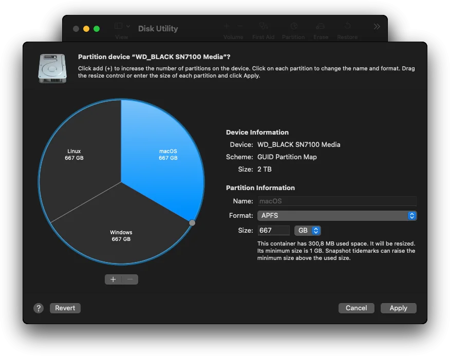
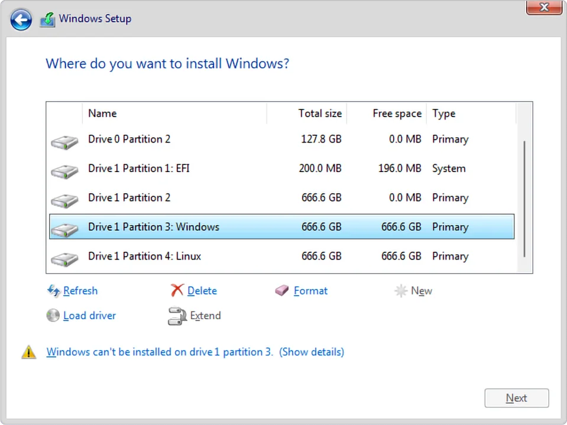
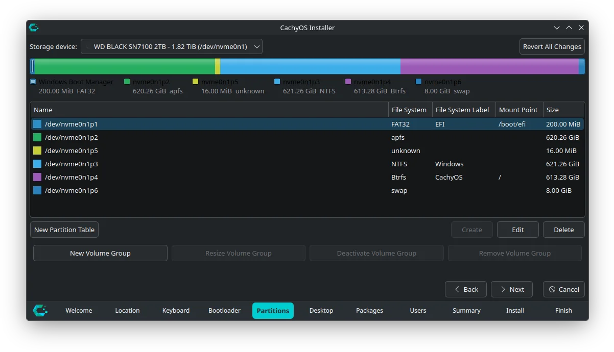

# Hackintosh triple boot

Dual or triple booting a hackintosh is easy if you keep in mind a few things before starting the whole process. 
Here I'll briefly explain how I got the three systems running on a single drive on the **Dell 7567** laptop from the start, without the need to resize any partition after the installation.

# TL;DR

If you want the simplified version, follow these steps:

1. Installation order: macOS -> Windows -> Linux
2. When booting into macOS, create your partitions with _Disk Utility_:
    - For macOS: use `APFS`, `GUID Partition Map` and name it _macOS_
    - For Windows: use `ExFAT` and name it _Windows_
    - For Linux: use `ExFAT` and name it _Linux_
3. Install macOS following the guide on [this repository](https://github.com/leandroprz/Dell-7567-Laptop-Hackintosh-OpenCore)
4. Install Windows. It will be formatted to `NTFS` automatically
5. Install your Linux distro:
    - Install _GRUB_ on your distro
    - Use `ext4` or `btrfs` for the OS and mount it on `/`
    - For the existing EFI partition use `fat32`, mount it on `/boot/efi` and use the flag `boot`. **Do not** format this one!
6. Boot using the macOS USB stick and copy the EFI folder from this repo into the EFI partition
7. Boot into Linux and install [rEFInd](https://www.rodsbooks.com/refind/index.html). This will allow you to boot into macOS, Windows and Linux
8. Configure rEFInd to your needs from Linux or macOS by modifying the `refind.conf` file

# Overview

The most important part of this whole process being the installation order of the operating systems.

The second thing to keep in mind is the size of the partitions. This depends on the size of your drive and how much space you want to asign to each OS.

The third one is related to the file system each OS uses. [There are a lot](https://en.wikipedia.org/wiki/List_of_file_systems), but most modern desktop OSes are using the following:

- macOS: HFS+ or APFS
- Windows: NTFS
- Linux: ext4 or Btrfs

## Installation order

This laptop has space for two physical drives, but I wanted to use one for the operating systems and the other for data. So I'll explain how to install all the OSes on a single drive.

The order that will make this work is the following:

1. macOS
2. Windows
3. Linux

## Partition sizes

We need to know upfront how much space we'll asign to each OS to avoid resizing after the installation as that can cause booting issues.

So let's do some simple math. I have a 2TB NVme drive, so I decided each OS will get a third of the drive: `(2TB x 1024) ÷ 3 OSes = ~680GB`. Each OS will have around **680GB**.

This is just an estimate, since:
- The exact formatted capacity depends slightly on the filesystem
- There's a difference between decimal terabytes (TB) used by manufacturers and binary tebibytes (TiB) used internally by operating systems
- We also need to account space for the `EFI/ESP` partition

### The EFI/ESP partition

The size of this partition will be determined by the boot manager we'll be using for our three OSes. In our case it will be [rEFInd](https://www.rodsbooks.com/refind/index.html).

Some guides recommend the size of the EFI to be [1GB](https://wiki.archlinux.org/title/EFI_system_partition#Create_the_partition), others [2GB](https://wiki.cachyos.org/installation/installation_on_root/#size-at-least-2048-mib) or even more, because they are adding the size of the Linux kernel into it. But we'll configure the Linux installation to not use the EFI partition to store the kernel, instead we'll use the Linux partition itself, where `/home` and `/` are located.

So, for our setup we can just use **200MB** (the macOS default) and it will work just fine. You can, however, follow the advice of the linked guides if you prefer.

Also, you can add the size of this partition to the math we did before, but it's so small you won't notice the difference practically.

## Partitioning the hard drive

Boot using your macOS USB stick. Once you get to the installer, choose _Disk Utility_. On the top left click on _View > Show All Devices_. Select your internal drive and click on _Erase_. Format it:

- Name: macOS
- Format: APFS
- Scheme: GUID Partition Map

Make sure you have the drive selected and click on _Partition_. You will see a new window where you can choose how many partitions you want.

When clicking on the + button to add a new partition, you might get a message like _"Do you want to add a volume to the APFS container or do you want to divide the container’s storage into separate partitions?"_, if that's the case, click on _Add Partition_.

Add three partitions to get something like this:

<a href="assets/macos-disk-util-partition.webp" title="Partition the drive in macOS">
    
</a>

Select the sizes you want for your drive.

Partitions:
1. macOS
    - Name: macOS
    - Format: APFS
2. Windows
    - Name: Windows
    - Format: ExFAT
3. Linux
    - Name: Linux
    - Format: ExFAT

Click on _Apply_.

An identifying name for each partition will be useful on the next steps. Don't mind the ExFAT partitions for now, they are serving as placeholders.

## Installation

### 1. macOS

Install macOS as described in the [main guide of this repository](README.md), using the bootable USB along with the custom EFI for this laptop.

### 2. Windows

Boot using the Windows installer and when asked, select _Custom install_.

You should see the partitions you created in macOS:

<a href="assets/win-install.webp" title="Windows installer">
    
</a>

Choose the one you previously named _Windows_, format it (the default file system is NTFS, this is automatic) and install Windows.

The installer will probably overwrite the macOS EFI configuration, but we'll fix that later.

### 3. Linux

This step will vary depending on your distro. I chose [CachyOS](https://cachyos.org/) for this laptop.

Boot using your Linux USB. Since CachyOS uses _Calamares_ as the installer, I'll be showing that. But no matter the distro, you basically need to install _GRUB_ as the bootloader and partition your drive as shown in the next steps. The partitioning can also be done using [GParted](https://gparted.org/).

CachyOS installer will ask you to select a bootloader, choose _GRUB_. We won't be using it, but since CachyOS doesn't have an option to not install a bootloader when running the _Calamares_ installer, I'm selecting that.

Plus, it is better to install _rEFInd_ at the end and you'll understand why in a bit.

When asked how you want to partition the drive, select _Manual partitioning_.

You'll see something like this:

<a href="assets/cachyos-install.webp" title="CachyOS installer">
    
</a>

Double click on the partition you previously named _Linux_. We need to change the partition as follow:

- Content: Format
- File system: ext4 or btrfs
- Mount point: /
- FS Label: CachyOS for me

If needed, you can resize it to make room for a **swap** partition. In that case, change the _Size_ at the top.

Now double click on the _EFI_ partition. Make sure you have the following:

- Content: Keep
- File System: fat32
- Mount Point: /boot/efi
- FS Label: EFI
- Flags: boot

Click on _Next_ to continue with the installation. You might get a warning about the EFI partition size, but you can ignore it. Select your Desktop manager and finish the installation.

## Boot manager configuration

Since Windows probably replaced the macOS configuration on the EFI partition, we'll fix that and also get the three systems working using a single boot manager to keep it as simple as possible.

### Fixing OpenCore

Boot using the macOS USB stick and select the macOS installation that's already present in your internal drive.

1. Once at the desktop run [MountEFI](https://github.com/corpnewt/MountEFI) and mount both the USB and internal SSD EFI partitions.
2. Copy the EFI folder from the USB to the internal SSD EFI partition. Your EFI partition should look like this:

```
EFI System Partition/
└── EFI/
    ├── BOOT/
    │   └── BOOTx64.efi
    ├── cachyos/
    │   └── grubx64.efi
    ├── Microsoft
    │   └── Boot/
    │   └── Recovery/
    ├── OC/
    │   └── ACPI/
    │   └── Drivers/
    │   └── Kexts/
    │   └── Resources/
    │   └── Tools/
    │   └── config.plist
    │   └── OpenCore.efi
    ├── refind/
    └── tools/
```

Done. You can now boot macOS without the USB installer.

### Installing rEFInd

Why _rEFInd_ instead of OpenCore? Simply put, the OpenCore bootloader will apply some macOS specific unwanted patches to the other systems when booting and we want to avoid that. You can read more about it [here](https://chriswayg.gitbook.io/opencore-visual-beginners-guide/advanced-topics/dual-boot-options).

Also, I found it easier to setup rEFInd as a boot manager and was able to get it exactly as I wanted.

To install rEFInd you need to boot into your Linux installation, then you can install rEFInd or just copy the files on this repository from the folder called _refind_.

#### Installing it as a package

The command you need to run depends on your distro:

- Arch based:
    ```
    sudo pacman -S refind
    sudo refind-install
    ```
- Debian based:
    ```
    sudo apt update
    sudo apt install refind
    sudo refind-install
    ```
- Fedora based:
    ```
    sudo dnf install refind
    sudo refind-install
    ```

#### Manual install

Download the latest [Release](https://github.com/leandroprz/Dell-7567-Laptop-Hackintosh-OpenCore/releases) or clone this repository:

```
git clone https://github.com/leandroprz/Dell-7567-Laptop-Hackintosh-OpenCore.git
```

Copy the `/EFI/refind` folder.

notice i'm using v0.14.0.2 because newer versions are showing duplicate tools in the boot picker.

#### Setting up rEFInd

## Finishing touches

choose the startup disk in macOS

Only keep macOS related disks in OpenCore boot picker: Security > ScanPolicy > 2687747 (number)

Misc > Boot > ShowPicker > False

## References and credits

- [Hackintosh & multiboot on my 2016 laptop - my tips](https://www.reddit.com/r/hackintosh/comments/1n8eqmh/hackintosh_multiboot_on_my_2016_laptop_my_tips/)
- [How to remove Windows and hide Tools and have a Clean OpenCore Boot Menu?](https://www.reddit.com/r/hackintosh/comments/mgt0ow/how_to_remove_windows_and_hide_tools_and_have_a/)
- [Dualbooting on the same disk](https://dortania.github.io/OpenCore-Multiboot/empty/samedisk.html)
- [Dual-Boot Options](https://chriswayg.gitbook.io/opencore-visual-beginners-guide/advanced-topics/dual-boot-options)


https://github.com/chriswayg/theme-minimal-black/
https://github.com/andersfischernielsen/rEFInd-minimal-black
https://www.youtube.com/watch?v=xZUH0UCL6AI